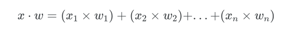
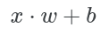

# Neural Netowrks with TensorFlow
In this workshop we will be trainin a neural network, using tensorflow, to classify different clothing pieces in the fashion-mnist dataset.

## What is Tensorflow?
```Tensorflow(TF)``` is an open source library for numerical computation and machine learning. Initially when ```Tensorflow 1.0``` was released, it had a high learning curve do to its unconventional structure and un-pythonic syntax. This led to the release of ```Tensorflow 2.0``` which incorporated ```Keras```; a simple to use deep learning framework. Due to this change Tensorflow is now intuitive and easy to use.

### How does Tensorflow work?
Tensorflow uses ```tensors``` for their computation. A tensor is an immutable multidimensional array with a uniform datatype. This can be see as similar to a [Numpy](https://numpy.org/) array.

Let's see how we can implement a tensor using Tensorflow
```python
import tensorflow as tf

t_one = tf.constant([1,2,3])
print("[1]", t_one)

t_two = tf.constant([5])
t_three = tf.multiply(t_one, t_two)
print("[2]", t_three)
```
**print log**
```
[1] tf.Tensor([1 2 3], shape=(3,), dtype=int32)
[2] tf.Tensor([ 5 10 15], shape=(3,), dtype=int32)
```

As you can see above, we used the ```tf.constant()``` class to create an instance of a tensor. We were also able to use functions such as ```tf.multiply()``` in order to perform an operation on our tensors. For the more information on tensors in tensorflow you can check out the documentation [here](https://www.tensorflow.org/guide/tensor). 

## What are Neural Networks?

```Neural Networks(NN)``` are sets of interconnected neurons that take in a large set of data and aim to discover an underlying pattern. While neural networks don't exactly emulate our biological neural networks, they are ```loosely inspired``` by how our brains learn.

Our brain doesn't learn concepts instantly, it usually takes different iterations of explanations and even trial and error to solidify our understanding of an idea. Imagine if you had no understanding of what cats and dogs were. If I showed you thousands of different pictures of cats and dogs, you would start to form an understanding and eventually you would become more confident in telling me which pictures were cats and which were dogs. While oversimplified, this is the basis of how neural networks learn.

Now that you have a high level overview of how neural networks learn, let's dive deeper and take a look at their structure.


Above, we can see an example image. The neural network is composed of 3 types of layers:
- **Input Layer**—This is the input of our network where we pass in our data(This could be text, images, sound, etc.) 
- **Hidden Layer**—This layer falls in between the input and output layers. It does the mapping between the input and output layers by performing a series of mathematical operations
- **Output Layer**—This can be seen as the results of our network

> The term "deep learning" comes from neural networks with more than 1 hidden layer. These types of neural networks are called deep neural networks. The neural network figure above displays a deep neural network because it contains 2 hidden layers. Neural networks with only 1 hidden layer can be referred to as simple neural networks.

### What is the function of the neuron?
Each neuron performs a set of mathematical operations to derive an output.


Above is an example of a randomly selected neuron. Each neuron will have a connection with every neuron in the previous layer. The way each neuron obtains its value is simple. It begins by summing up every input. The input consists of the input value(x) as well as an associated weight(w). When the model is trained, these weights shift around in order to get the optimal model. The weights carry influence as to how strong a connection between two neurons are. The higher the weight the influence of the neuron. 

<center>

</center>
Above we summed up every input which consisted of the input multiplied by the weight. We can further simplify this as the summation equals the dot product of the vectors x and w.

Furthermore, we also have to add the bias(b) term to transpose the constant value to obtain the output values.
<center>

</center>
Finally, to obtain the neurons output value, we pass it through an activation function in order to introduce non-linearity into the neurons output. Without the activation function, our neural network is essentially a linear regression model. With the activation function, our model is able to learn more complex tasks. There are several activation functions, but in this post we will be going over the **ReLU activation function**.
<center>

</center>
Rectified Linear Unit(ReLU) is a standard activation function. It is widely used because of how well it works. Typically when you are unsure of which activation function to use, ReLU should be your go to.

The steps outlined above occur through every neuron in the neueral network until the network reaches its end. This process of passing data through the neural network is called **forward propogation**. Once this process is completed we move on to backpropogation.

## What is backpropogation?
**Back-propagation** fine tunes the model based on the results of forward propogation every iteration. After a forward pass, the neural network calculates the loss function and propogates those results backwards to tune the weights and biases. Since the model is updating its weights and biases every iteration, the model should become more optimized. The goal is to lower this error rate.

> The loss function is highly related to the cost function however, the loss function refers to the error of one training sample, while the cost function is the average of the entire training set

For our purposes, we'll be using ```Sparse Categorical Crossentropy``` for the live coding workshop. While I won't be going over the math for this loss function, it is important to note that sparse categorical crossentropy is a good loss function to use when you are dealing with multiclass classification problems like the one we'll see in our workshop.

For all the loss functions that can be found on keras, you can check out their [docs page on losses](https://keras.io/api/losses/)

Once we have our loss value, we backpropogate those results through an optimization technique. For our workshop, we'll be utilizing the ```Adam``` optimizer. Similar to prevous algorithms we've covered, this optimizer is the standard one to use when you are unsure which to use. It is popular because of how well it works for a lot of general problems.

For all the optimizers on keras, check out their [docs page on optimizers](https://keras.io/api/optimizers/)

## Getting started with the workshop
For this live-coding portion, we'll be training our own neural network using tensorflow! Our goal is to classify different clothing items from the fashion-mnist dataset.

To begin the live coding workshop [click here](https://colab.research.google.com/drive/1J8nZzc90pJQDqw74sIaxkzMTLGqwfsQ6?usp=sharing)

### Let's Begin

As usual, we begin by importing our libraries
```python
import tensorflow as tf
from tensorflow import keras
from tensorflow.keras import layers
import matplotlib.pyplot as plt
import numpy as np
```

As expected we have keras and tensorflow for creating our model. We'll also be using matplotlib in order to print out the images from the dataset. Now that our imports are in place, we also need to load our dataset.

```python
fashion_mnist = tf.keras.datasets.fashion_mnist
(x_train, y_train), (x_test, y_test) = fashion_mnist.load_data()
```

This dataset comes standard with tensorflow, so we can directly import it from tensorflow. Typically, we like to seperate our data when training our model. We call this a ```train-test split```. The reason for this is because we don't want to test how well our model performed on our training data. Our model could just memorize the dataset and overfit to it. If we have something to compare the models accuracy compared to the accuracy of data it has never seen before, we can better judge how well our model is actually performing.

The data with the x, represents images while data with a y represented their labels. Our goal is to train a model that given x image can predict y label. Our model will learn by taking in images and making a prediction. It will then be given the answer and will make changes to the network in order to optimize the model.

```python
x_train, x_test = x_train / 255, x_test / 255 
```

Before we begin training our model we have a little more preprocessing to do. We normalize our image data to be between 0 and 1. Since we are dealing with image data, we get values from 0 to 255. By dividing each image by 255, this normalizes our data to be between 0 and 1. This helps to speed up our training process since smaller numbers are being computed.

```python
class_names = ['T-shirt/top', 'Trouser', 'Pullover', 'Dress', 'Coat',
               'Sandal', 'Shirt', 'Sneaker', 'Bag', 'Ankle boot']
```

We also declare a list with all the labels. As mentioned we'll be classifying between 10 different objects. Those objects are listed above.

```python
class_names = ['T-shirt/top', 'Trouser', 'Pullover', 'Dress', 'Coat',
               'Sandal', 'Shirt', 'Sneaker', 'Bag', 'Ankle boot']

plt.figure(figsize=(10,10))
for i in range(25):
    plt.subplot(5,5,i+1)
    plt.xticks([])
    plt.yticks([])
    plt.grid(False)
    plt.imshow(x_train[i], cmap=plt.cm.binary)
    plt.xlabel(class_names[y_train[i]])
plt.show()
```
We then create a simple grid plot to show a couple example of the images we're working with. 

Now that we have all of our data preprocessed, we can begin by creating our model. We will use Keras to first define the structure of our model.

```python
model = keras.Sequential() # Initializing model

model.add(layers.Flatten(input_shape=(28, 28))) # Input layer
model.add(layers.Dense(128, activation='relu')) # Hidden layer
model.add(layers.Dense(10)) # Output layer

```

We begin by defining our model. We create a ```Sequential()``` class that will contain all the layers of our model. This class is the standard class for creating simlple neural networks. It is typically what you'll be using for creating models.

We then use the ```add()``` function to add layers to our model. We first define our input layer by flattening the image. Neural networks take 1-dimensional data, so we flatten our image. Essentially we take all the rows and stack them vertically to create a 1-dimensional shape.

<center>
![image Flatten](data:image/png;base64,iVBORw0KGgoAAAANSUhEUgAAASwAAACoCAMAAABt9SM9AAAAmVBMVEX///+80eKPqsBgepa4zuBVcpDL0tqHpLyKpr1UcZCXprjy9vnr7/P0j471mpn//Pza5e/O3enW2+LL1uDE0dzCytTt8fSiuMra4umZscWwu8jC1eSElqt8kKewwtGdq7twh59FZohogJvK2uji6/Kms8GOn7K8xdB9nbesv8/0iYjh5OmUf5K4wc1KaoqvobLbtr/rp6rwU1EVh8vpAAAHmUlEQVR4nO2da3eiSBBAywjyaGaDgIghokZ8DRt3d/7/j1vMntDVTvVsetPOOlD35INYwAn3dBeNQDUAwzAMwzAMwzAMwzAMMyi+frHL1//7gG7JF8v7++3R8g7vCZZlQCtLJDQAmoCAhg5E/ZcVngOKTZRsyMD5CehA8NJ/WSt3TBFESUAG3Cc4k4HxmmWxrHdYlgEsywCWZQDLMkCVhe2osp5furUUWcFyKddaD0iW+wwTJA7J2kPyuOtWQ7KCqGmabrX1gGSF0W5GygpgHZzhfQnLCpPzJl8OUdbLOdS1LNcdk7LGrrsWv1I3XIWf4PfVat0d7Fgnyz2vYN8tKLIOMPuVumH4mY3VBK+T9ZIndIJfjt1NEQ5SVhDO0HkO5awm3LiULLcJ3eD16T20HpCs/WsSva4oWTCbzSbU2fAZVjt4GWLLet7tVrsuNeFuuNq1ULLc5ezQuRqUrPbU5tI5S4moI3i0xbBkKfTzcodlGcCyDGBZBrAsAz4rKwxcinOTnOnAE2zIwK9wd+ezsqLDjASA/v6Qw4SOJP2XBRHNDwKCDoj+y6o8n+KY10cy4GWgCSwGIMt/oPCi2iMDfgZ04GHAsnKWdQXLMoBlGcCyDGBZBlzJ8qUGLMu/jC5IWd5iITcflixPSA9Iln8CAen7aliWF+Wi6LYflCyvyGhZaXb0qJblp8XxmC8GJOvQNZm5OJKyvDorUkqWJxZpsuh3yxJVxx9V1TUMD9o/smXlxTwV3RKSBVFVwbzXsuqi+4hall+kiwU8ELIe2j7YNiJKVuV5VZe0BiCr6mRdflHojhzLaj8dKVl+VPnDlPVw+akBjlTOaupTERHd0J/DwLqhMijN5KkRd8OsyMhxlr9Iinm/E/wPZKExFx7BozHp1QgeBQYnS8KXO//AsgxgWQawLANYlgFXsui7O17eaALDurujyopSGgBNIIeEDhT9l2WVvsuKHRohNIEaNIGy/7KmIxJHRA4diIEOjFgWy+o+sqx/g2UZwLIMYFkG6GS9nf9JWeh7VRYODEpW+RZ7P3gsqxQAJSlLYNlDknVpJnVMtCwnnzpb0S1JWU4UOyMYpqzL4VLd0Il0suBNWLd1Xf9ZdwibB2kLi7IcgZoZzlkgyG7o5O21kuy5pRB/iXei2OZB2sKiLNl81JYFW2cLRMt6y1m1lIW7oajtHJ5dLOYs2OJWFkkJTrv43rSwrLJs0xw+QwxH1hQ1LLVlxWVMtqwplFukbkCynLrLS6OrnBWJiBw6OFORy42GJGukDMw/NigdaQelfZel8NnLHZbFsljWj2BZBrAsA65kaZwYy3IGIKue0oCgv9/moNki7r8sq7AsA3ot69tvdvnW7bmHsuDRLnLHfZR1M1iWASzLAJZlAMsygGUZwLIMYFkGsCwDWJYBvZGV5ZrSWBYf6+iLrEfN2wBpmtn7t/oiSw/L+jiCZX0clmUAyzKAZRnAsgxgWQawLANYlgH2ZAnRyspt7c0Wk1bWxM6uRNSO4G1dY29FPb27J+F3k93rzNK+TlFaRZb2BaVzd65aW8HB2r7mnjVXcH+d8EJicV93mZSZn8jjhEaAJtBAQwcSKDKSFHI6kAnQBGqoY5IaBB2IATQBiwlvpple4vComV5iCWt6qopNm6jo4vmQasqrFEJTXuUEI03FB23xiFxXPGJqURY9o4k7e6RnNBk/w5IOBLJk31XhHlnz9qpwTyE0hXsqKMnnJy/vs2ierMyF5vlUi++UsSyWxbJYFst6UEpvfkwWLr15/7JcNFuvKivcywUsK3gO0ZyPWJY/P8mirlhWVVXdaqqsLENrIVllCynL2eKXspEsp5yW0txNZC1Fjia4RLLWMCnk5OFIVpA0EzmPqtqycPF8JKsSSSGrCmNZkKYgV5OypkIIkGUPpCynFjV6OR3JituLLenxFrLWYhmRstxiFWyizhCS9RJtzoduhl4sy8vnpCw/rXDxfCnLL7LjMetqpOOWdRmJUi3LgXbAKSttSFmXgANInX1Z42BMyxqvx24gG5DSDcdLaRHJ8rPiSMuKijynuqEHp1xk3SZKznJq1PWQLBGPZEEEVRZ+o/02OetFI2t8DqGboVeR5YZRI82hotvC82hZReUtgOiGHtS+l1ekrBGuWINkxUqNCCSrtRjLfvhzZblNI2cVx7KWa/e8m3zfDT3RXlJDRch68N66KCWr/fLU+IQsVEhEkbWFS21Aohu+ZbPoti3LHUdnuYBy1uywCShZ7uvk7O6T72X5lx8OSFk++G2bI7qhX6Sel6WUrFJ561zKmuY4NSkJvsRp7haylpMJzA4uIatokqSgEvwYDk/wTHTDyw8HdDc8QCEy8mwo6kLO5IBk4UItVwk+ioFK8KMpxKK+aYJfh/t92M0qjrvh876NkAne3T2t5QlCHZR2ZzalG/qLakGdDdu1Tid6nKW88qmMs+J4KxeUcVY8vfE4S+GDI3g8q/gHL3fwx8+O4PFHZQSP/d6NLAxfG7IslsWyWNZ9ybJ6d4fkCOmRDhSCDniVxbs7FmXp7xsmxvcNNTNo5z+YdFvzzgG8PT1D8V8CDMMwDMMwDMMwDMMwDMMwDGOZvwFYLDvPXtRKFwAAAABJRU5ErkJggg==)
</center>

Afterwards, we add our first hidden layer. This is a standard layer with 128 neurons and it uses the relu acitvation function.

Lastly, we declare our output layer. The neurons in this layer should correspond to the amount of objects you are trying to classify. In this example we are classifying 10 different objects so we'll have our output layer include 10 neurons.

```python
model.compile(
    optimizer='adam',
    loss=tf.keras.losses.SparseCategoricalCrossentropy,
    metrics=['accuracy']
    )
```

Now we specify a couple more metrics for our model. We include the optimizer we'll want to use as well as the loss function. We also include a metric to display the accuracy of our model as we're training it.

```python
model.fit(x_train, y_train, epochs=10)
```

Finally, we use the ```fit()``` method to begin training our model. We specify our training data as well as how many times we want to iterate through our dataset. This iteration is called an ```epoch```. We specify 10 epochs which means it will complete a full training cycle 10 times.

```python
test_loss, test_acc = model.evaluate(x_test,  y_test, verbose=2)
```

Now that our model is trained, we pair it up against our testing data to see how well it actually did.

The entire code for this workshop, including the portions not mentioned here can be found [here](https://colab.research.google.com/drive/1S_UDN1W8ffc7CyR-3MXc4_VuZAxpGOx4?usp=sharing)